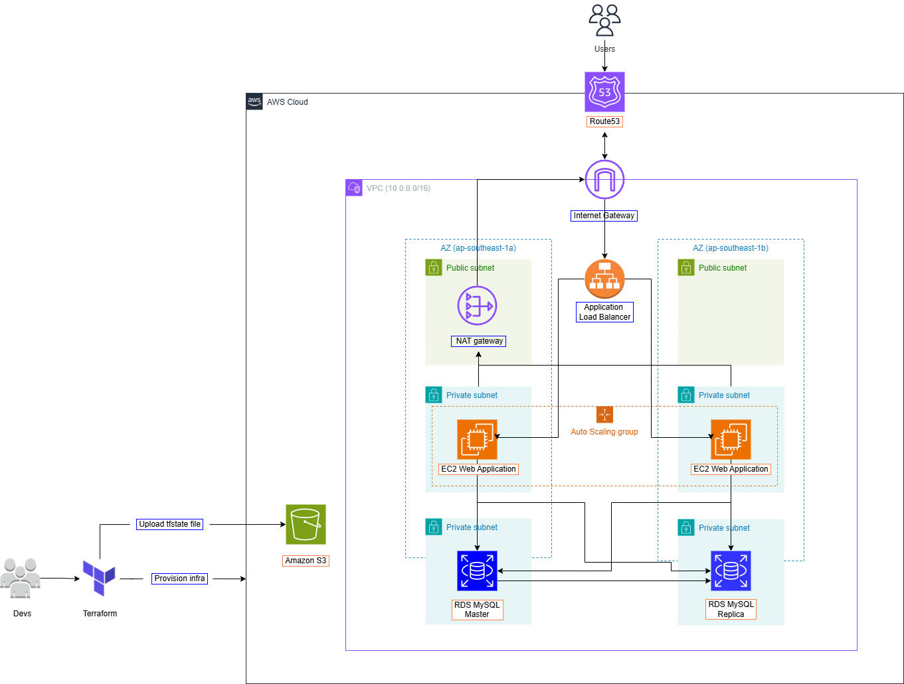

# High Availability Web Application Using Terraform

## Description

Dự án này triển khai một ứng dụng web với kiến trúc **High Availability** trên nền tảng **AWS** sử dụng **Terraform** để quản lý hạ tầng. Ứng dụng được thiết kế để đảm bảo tính sẵn sàng cao, khả năng mở rộng và dự phòng khi có sự cố xảy ra. 

  
  
<em>Hình 1: Kiến trúc triển khai ứng dụng trên AWS</em>

Source code cho ứng dụng web [tại đây](https://github.com/5hry/e-commerce-web-bluegreen-deploy)

## Features

- **Tự động mở rộng**: Ứng dụng có khả năng điều chỉnh tài nguyên một cách tự động dựa trên tải thực tế, giúp tối ưu hóa hiệu suất và chi phí.
- **Chịu lỗi cao**: Hệ thống có khả năng duy trì hoạt động ngay cả khi một số thành phần hoặc vùng bị lỗi, đảm bảo độ tin cậy cao.
- **Cân bằng tải**: Đảm bảo việc phân phối lưu lượng truy cập một cách đồng đều giữa các phiên bản để duy trì hiệu năng ổn định.
- **Hạ tầng dưới dạng mã (IaC)**: Sử dụng Terraform để tự động hóa việc triển khai và quản lý hạ tầng, giúp giảm thiểu sai sót cấu hình thủ công và tăng tính nhất quán.

## Yêu cầu

### Công cụ và nền tảng:

- **Terraform**: Sử dụng để quản lý và triển khai hạ tầng AWS.
- **AWS**: Nền tảng điện toán đám mây dùng để triển khai các thành phần của ứng dụng web.
- **Git**: Sử dụng để quản lý mã nguồn của dự án.

### Các tài nguyên AWS được triển khai:

- **EC2 Instances**: Cài đặt máy chủ cho ứng dụng web.
- **Load Balancer**: Cân bằng tải giúp phân phối lưu lượng đều đặn giữa các phiên bản.
- **Auto Scaling Groups**: Điều chỉnh số lượng phiên bản EC2 dựa trên tải thực tế.
- **RDS**: Chạy database của ứng dụng.
- Services khác: **Route53, VPC, S3,** ...
## Cài đặt và triển khai

### Updating ...